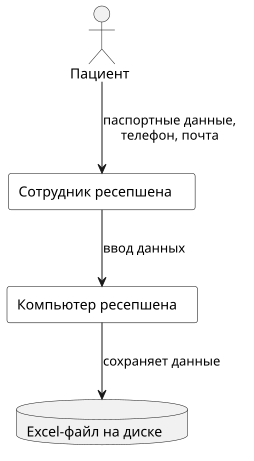
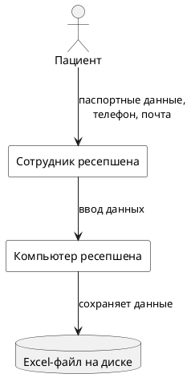
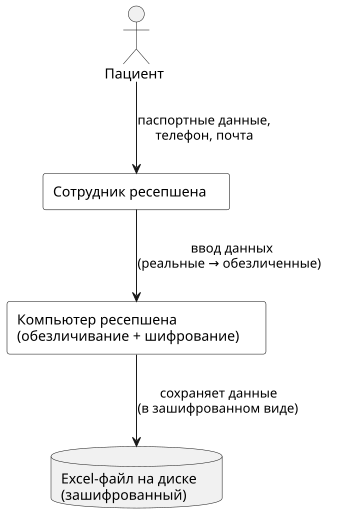
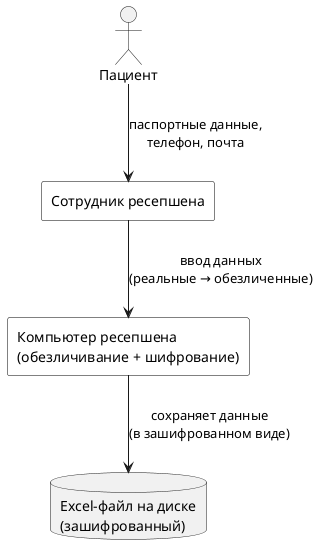
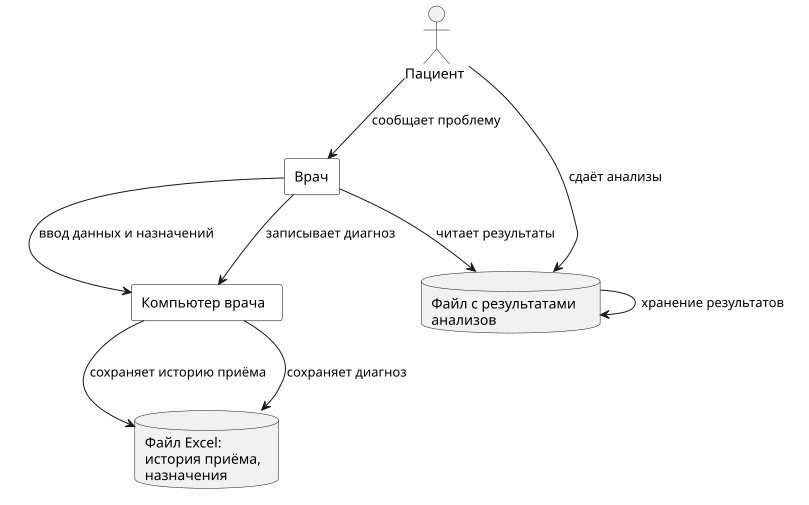
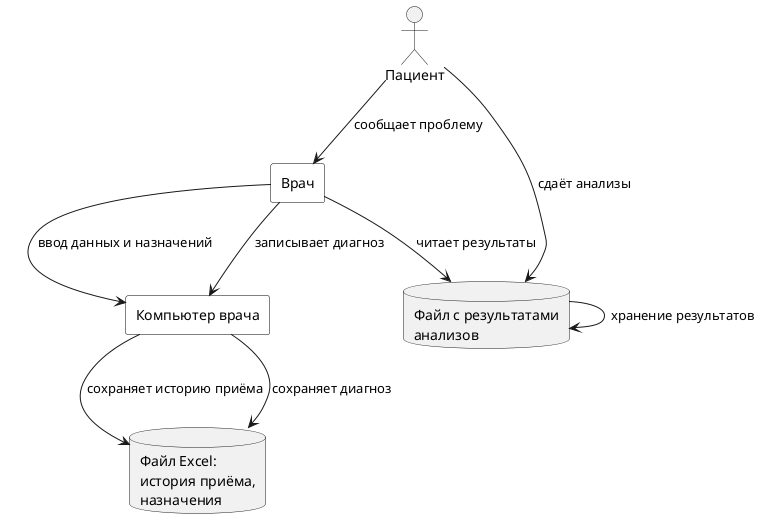
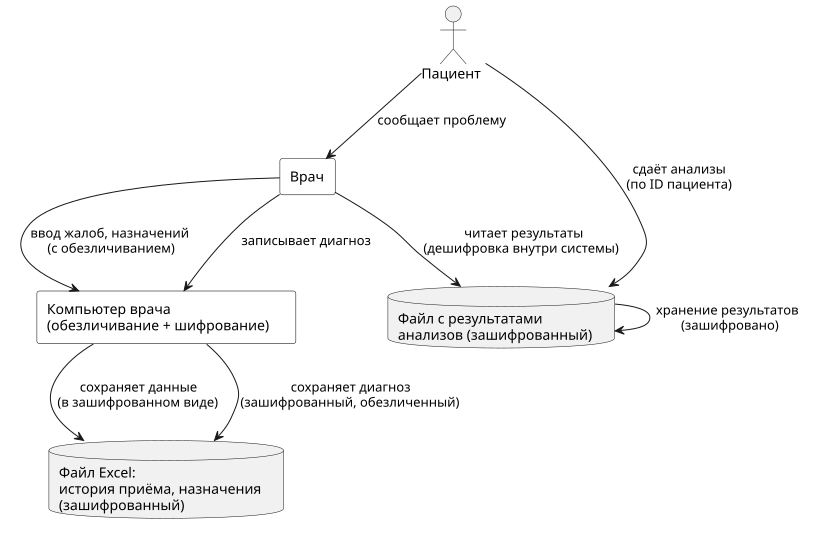
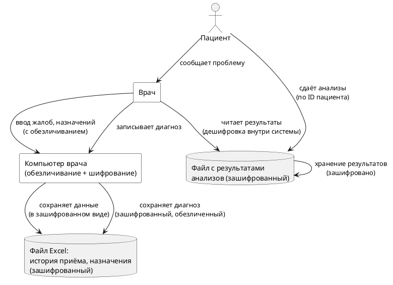

## Table of content
- [Проблемы](#проблемы)
- [Типы данных и их защита](#типы-данных-и-их-защита)
- [Data Flow Diagram](#data-flow-diagram)

## Проблемы
Все операции с данными команда производит вручную.

Журналы приёма пациентов, учёт пациентов и платежей, медицинские карты, учёт анализов лежат на общем диске.

Внутренние потоки данных между IT-продуктами никак не контролируются. Ограничения по передаваемым данным обусловлены только бизнес-процессами компании. Кроме доменной аутентификации, со стороны систем обработки нет ограничений на доступ к данным.

Ручная запись клиентов.

Работа с конфиденциальными данными и PII (Personally Identifiable Information) не в полной мере отвечает требованиям российского законодательства.

## Типы данных и их защита

Любой бизнес-процесс в компании сопровождается обращением к конфиденциальным данным разного уровня.

### Персональные данные 
ФИО, Дата рождения, Телефон, Электронная почта, Адрес прописки, Место работы / учёбы.

Защита: 
- Шифрование — для хранения и передачи.
- Обезличивание — если данные нужны для аналитики без привязки к личности (замена на псевдонимы или хеши).

### Медицинские данные 
медкарта, информация о приёмах, диагнозы, назначения, результаты анализов.

Защита:
- Шифрование — обязательно при хранении и передаче.
- Обезличивание — особенно при передаче третьим лицам (исследования, внешние системы).

### Финансовые данные
платежи, финансовые отчеты, данные кассы, зарплаты - конфиденциальные данные.

Защита
- Шифрование — для всех данных (банковские транзакции, суммы, зарплаты).
- Обфускация — можно применять к частям (например, маскирование номеров карт, ИНН, счетов).

### Тегирование
Добавим в таблицы postgresql столбец tags или metadata. В них будут нужные теги. По этим тегам и пользователю реализуем ABAC (Attribute-Based Access Control), используя RLS (Row-Level Security) или логику в приложении.

### Ещё способы защиты
- HashiCorp Vault — для ключей и секретов
- PostgreSQL с шифрованием — вместо Excel-файлов
- ELK Stack — для аудита всех операций
- Keycloak — для ролевого доступа

## Data Flow Diagram
Остановимся на 2 процессах: запись на прием и сам прием.

### Запись на прием

plantuml

#### С применением способов защиты:

plantuml

### Прием у врача

plantuml

#### С применением способов защиты:

plantuml

