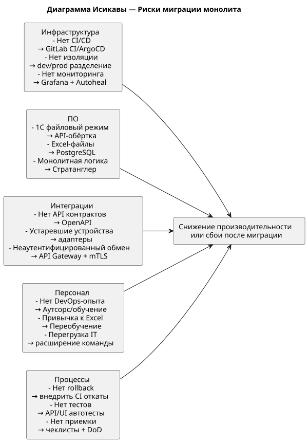
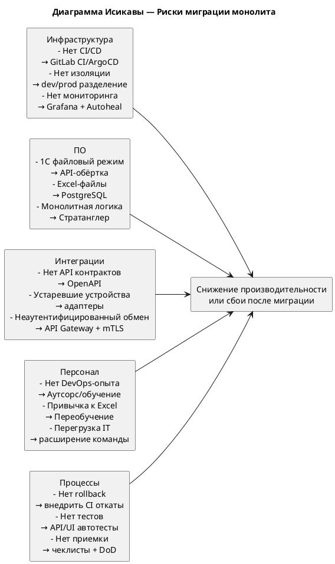

Структура диаграммы: <br>
```
Раздел
- Проблема --> решение
- Проблема --> решение
- Проблема --> решение
```



```plantuml
@startuml
left to right direction
skinparam monochrome true
skinparam defaultTextAlignment center
title Диаграмма Исикавы — Риски миграции монолита

' Главная проблема
rectangle "Снижение производительности\nили сбои после миграции" as Problem

' Категории
rectangle "Инфраструктура\n- Нет CI/CD\n→ GitLab CI/ArgoCD\n- Нет изоляции\n→ dev/prod разделение\n- Нет мониторинга\n→ Grafana + Autoheal" as Infra
rectangle "ПО\n- 1С файловый режим\n→ API-обёртка\n- Excel-файлы\n→ PostgreSQL\n- Монолитная логика\n→ Стратанглер" as Soft
rectangle "Интеграции\n- Нет API контрактов\n→ OpenAPI\n- Устаревшие устройства\n→ адаптеры\n- Неаутентифицированный обмен\n→ API Gateway + mTLS" as Integr
rectangle "Персонал\n- Нет DevOps-опыта\n→ Аутсорс/обучение\n- Привычка к Excel\n→ Переобучение\n- Перегрузка IT\n→ расширение команды" as HR
rectangle "Процессы\n- Нет rollback\n→ внедрить CI откаты\n- Нет тестов\n→ API/UI автотесты\n- Нет приемки\n→ чеклисты + DoD" as Proc

' Стрелки
Infra --> Problem
Soft --> Problem
Integr --> Problem
HR --> Problem
Proc --> Problem
@enduml
```